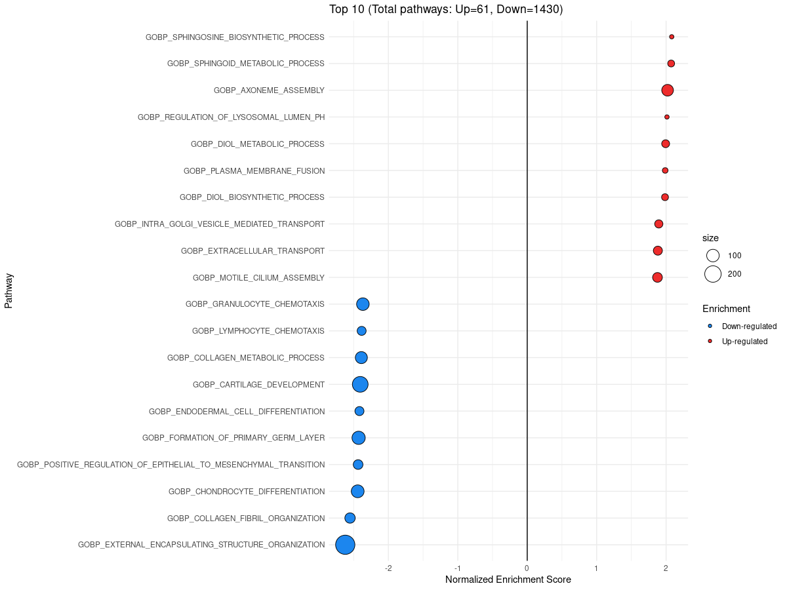
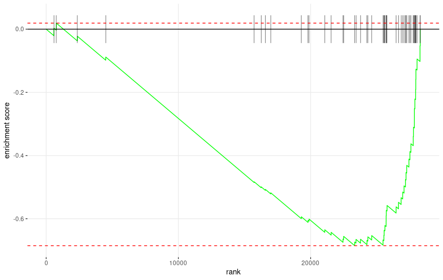
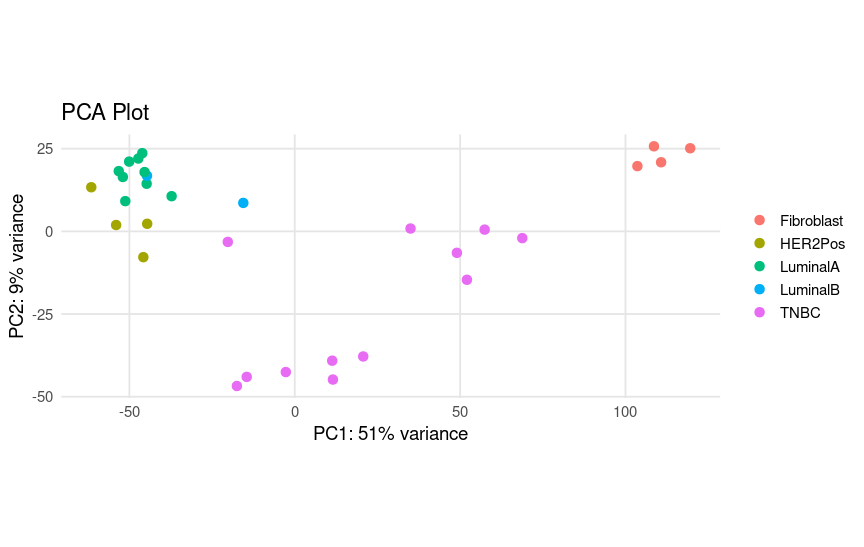

# Functional Genomics Practice: ORA and GSEA in Breast Cancer

This practice focuses on interpreting differential gene expression results using two major approaches:

1. **Over-Representation Analysis (ORA)** — detects enriched biological terms among significantly differentially expressed genes.
2. **Gene Set Enrichment Analysis (GSEA)** — identifies consistent expression trends across ranked gene sets.

We use differentially expressed genes from the comparison of **Luminal A** and **Triple Negative Breast Cancer (TNBC)** subtypes, from previous practice.

---

## Setup

Install required packages in R (if not already installed):

```r
install.packages(c("enrichR", "fgsea", "dplyr", "msigdbr", "ggplot2"))
```

Load the analysis results prepared from the previous practice:

```r
load("func_annotation.RData")
```

---

## Over-Representation Analysis (ORA)

ORA is used to identify significantly enriched biological terms among upregulated or downregulated genes.

```r
library(enrichR)

# Defining gene set databases
dbs <- c("GO_Molecular_Function_2023", "GO_Cellular_Component_2023",
         "GO_Biological_Process_2023", "KEGG_2021_Human")

# Running ORA analysis
ora_up <- enrichr(res_signif_up$gene_name, databases = dbs)
ora_down <- enrichr(res_signif_down$gene_name, databases = dbs)

# Filtering results by adjusted p value
ora_up <- lapply(ora_up, function(x) x[x$Adjusted.P.value < 0.05, ])
ora_down <- lapply(ora_down, function(x) x[x$Adjusted.P.value < 0.05, ])

# Exploring results
View(ora_up)
View(ora_down)
```

### Interpreting ORA Results

- Upregulated genes showed **no significant enrichment** in biological processes.
- Downregulated genes showed **enrichment of pathways related to malignant transformation**, consistent with TNBC's aggressive phenotype.

---

## Gene Set Enrichment Analysis (GSEA)

GSEA evaluates whether predefined gene sets show statistically significant, concordant differences between two biological states across a ranked gene list.

```r
library(fgsea)
library(dplyr)

# defining GSEA function
GSEA <- function(gene_list, GO_file, pval) {
  set.seed(54321)
  
  myGO = GO_file
  
  fgRes <- fgsea::fgsea(pathways = myGO,
                        stats = gene_list,
                        minSize=15, ## minimum gene set size
                        maxSize=500, ## maximum gene set size
  ) %>% 
    as.data.frame() %>% 
    dplyr::filter(padj < !!pval) %>% 
    arrange(desc(NES))
  message(paste("Number of signficant gene sets =", nrow(fgRes)))
  
  # message("Collapsing Pathways -----")
  # concise_pathways = collapsePathways(data.table::as.data.table(fgRes),
  #                                     pathways = myGO,
  #                                     stats = gene_list)
  # fgRes = fgRes[fgRes$pathway %in% concise_pathways$mainPathways, ]
  # message(paste("Number of gene sets after collapsing =", nrow(fgRes)))
  
  fgRes$Enrichment = ifelse(fgRes$NES > 0, "Up-regulated", "Down-regulated")
  filtRes = rbind(head(fgRes, n = 10),
                  tail(fgRes, n = 10 ))
  
  total_up = sum(fgRes$Enrichment == "Up-regulated")
  total_down = sum(fgRes$Enrichment == "Down-regulated")
  header = paste0("Top 10 (Total pathways: Up=", total_up,", Down=",    total_down, ")")
  
  colos = setNames(c("firebrick2", "dodgerblue2"),
                   c("Up-regulated", "Down-regulated"))
  
  g1= ggplot(filtRes, aes(reorder(pathway, NES), NES)) +
    geom_point( aes(fill = Enrichment, size = size), shape=21) +
    scale_fill_manual(values = colos ) +
    scale_size_continuous(range = c(2,10)) +
    geom_hline(yintercept = 0) +
    coord_flip() +
    labs(x="Pathway", y="Normalized Enrichment Score",
         title=header) + 
    theme_minimal()
  
  output = list("Results" = fgRes, "Plot" = g1)
  return(output)
}


# Rank genes by p-values
res_raw <- res_raw[order(res_raw$stat, decreasing = TRUE), ]
ordered_gene_list <- setNames(res_raw$stat, substr(rownames(res_raw), 1, 15))

# Load gene sets
library(msigdbr)
pathwaysDF <- msigdbr(species = "Homo sapiens", subcategory = "GO:BP")
pathways <- split(as.character(pathwaysDF$ensembl_gene), pathwaysDF$gs_name)
```

### Run GSEA and Visualize Results

```r
gsea_res <- GSEA(ordered_gene_list, pathways, pval = 0.05)

gsea_res$Plot
```

**Figure: GSEA summary plot (top 10 up/downregulated pathways)**  
<!-- -->


```r
fgsea::plotEnrichment(pathways[["GOBP_POSITIVE_REGULATION_OF_EPITHELIAL_TO_MESENCHYMAL_TRANSITION"]], ordered_gene_list)
```

**Figure: Enrichment plot for EMT (epithelial to mesenchymal transition)**  
This pathway plays a major role in metastasis and invasion in cancers like TNBC.  
<!-- -->

---

## PCA Visualization

PCA helps visualize overall sample separation based on gene expression.

```r
library(DESeq2)
library(ggplot2)

plotPCA(vst(dds, blind=FALSE), intgroup="Subtype") + 
  theme_minimal(base_size = 14) +  # Improve aesthetics
  labs(title="PCA Plot") +
  theme(
    legend.position="right",
    legend.title = element_blank(),
    panel.grid.major = element_line(color="grey90"),
    panel.grid.minor = element_blank()
  )
```

**Figure: PCA plot of Luminal A and TNBC subtypes**  
<!-- -->
