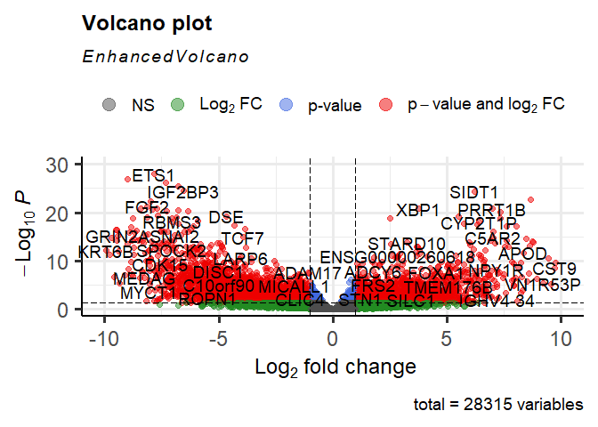

OMICSS25:Practice of the Transcriptomics Course
================

# Welcome to the Practice of the Transcriptomics Course

A basic step in analyzing RNA-seq count data is finding genes that are
expressed differently between conditions. The data usually come in a
table showing, for each sample, how many sequencing reads map to each
gene. Similar types of data also come from experiments like ChIP-Seq,
HiC, shRNA screens, and mass spectrometry. An important question in
analysis is to measure and test if there are real differences between
conditions, beyond the normal variability seen within each condition.
The DESeq2 package helps test for differential expression using negative
binomial models. It uses data-based prior distributions to improve the
estimates of variability and log fold changes.

# System preparation

## Package installation

Please follow the provided instructions to install “DESeq2”,
“EnhancedVolcano” and “ashr” packages.

To install these packages, start R and enter:

``` r
if (!require("BiocManager", quietly = TRUE))
    install.packages("BiocManager")

  BiocManager::install("DESeq2")
  BiocManager::install("EnhancedVolcano")
options(repos = c(CRAN = "https://cran.r-project.org"))
install.packages('ashr')
```

## Set the working directory and load the installed libraries

``` r
setwd('/path/to/your/directory/with/dataset')
library(DESeq2)
library(EnhancedVolcano)
library(ashr)
```

# Input data generation

## Read the read counts matrix

As input, the DESeq2 package expects count data as obtained, e.g., from
RNA-seq or another high-throughput sequencing experiment, in the form of
a matrix of integer values. The value in the i-th row and the j-th
column of the matrix tells how many reads can be assigned to gene i in
sample j.

``` r
counts_path <- "dataset/STAR_counts.tsv"
counts <- read.csv(
  counts_path, header = TRUE, sep = "\t", row.names = 1
)
dim(counts)
```

    ## [1] 62696    31

``` r
head(counts)
```

    ##                   SRR8618301 SRR8615297 SRR8615321 SRR8615337 SRR8615338
    ## ENSG00000290825.1          2          0          1          0          5
    ## ENSG00000223972.6          0          0          0          0          0
    ## ENSG00000227232.5         91        265         19         72        377
    ## ENSG00000278267.1         15         10          0         14         32
    ## ENSG00000243485.5          0          6          2          0          0
    ## ENSG00000284332.1          0          0          0          0          0
    ##                   SRR8615416 SRR8615418 SRR8615420 SRR8615458 SRR8615532
    ## ENSG00000290825.1          0          0          0          2          0
    ## ENSG00000223972.6          0          0          0          0          0
    ## ENSG00000227232.5         43         37         47        109        150
    ## ENSG00000278267.1          4         12         12         35         31
    ## ENSG00000243485.5          0          2          0          6          0
    ## ENSG00000284332.1          0          0          0          0          0
    ##                   SRR8615578 SRR8615581 SRR8615582 SRR8615584 SRR8615756
    ## ENSG00000290825.1          1          0          0          0          1
    ## ENSG00000223972.6          0          0          0          0          0
    ## ENSG00000227232.5        126         52         78         48        227
    ## ENSG00000278267.1          4         20         17         19         16
    ## ENSG00000243485.5          0          1          2          3          0
    ## ENSG00000284332.1          0          0          0          0          0
    ##                   SRR8615758 SRR8615766 SRR8615767 SRR8615774 SRR8615812
    ## ENSG00000290825.1          0          3          0          1          2
    ## ENSG00000223972.6          0          0          0          0          0
    ## ENSG00000227232.5        120        164         65        108        210
    ## ENSG00000278267.1         12         19          3         14         21
    ## ENSG00000243485.5          0          0          0          0          3
    ## ENSG00000284332.1          0          0          0          0          0
    ##                   SRR8615816 SRR8615817 SRR8615819 SRR8615822 SRR8616001
    ## ENSG00000290825.1          0          2          0          0          0
    ## ENSG00000223972.6          0          0          0          0          0
    ## ENSG00000227232.5         62        151        231         42        126
    ## ENSG00000278267.1         10         21          3          6         15
    ## ENSG00000243485.5          1          9          0          2          0
    ## ENSG00000284332.1          0          0          0          0          0
    ##                   SRR8616175 SRR8616179 SRR8616180 SRR8616183 SRR8616196
    ## ENSG00000290825.1          0          1          0          1          0
    ## ENSG00000223972.6          0          0          1          0          0
    ## ENSG00000227232.5         87        100        296        138        112
    ## ENSG00000278267.1         15         15         25         32         24
    ## ENSG00000243485.5          0          1          0          0          1
    ## ENSG00000284332.1          0          0          0          0          0
    ##                   SRR8616197
    ## ENSG00000290825.1          0
    ## ENSG00000223972.6          0
    ## ENSG00000227232.5        103
    ## ENSG00000278267.1          8
    ## ENSG00000243485.5          0
    ## ENSG00000284332.1          0

## Read the sample metadata

Information about each sample (e.g., subtype, condition) necessary to
define groups for comparison.

``` r
metadata_path <- "dataset/metadata.tsv"
metadata <- read.csv(
  metadata_path, header = TRUE, sep = "\t", row.names = 1
)
dim(metadata)
```

    ## [1] 31  5

``` r
head(metadata)
```

    ##               Name ER  PR HER2    Subtype
    ## SRR8618301   ZR751  + +/-    -   LuminalA
    ## SRR8615297  DU4475  -   -    -       TNBC
    ## SRR8615321  HS742T  -   -    - Fibroblast
    ## SRR8615337 UACC893  -   -    +    HER2Pos
    ## SRR8615338 UACC812  + +/-    +   LuminalB
    ## SRR8615416  HS274T  -   -    - Fibroblast

## Read gene annotation

Gene names and types to annotate results for interpretation.

``` r
gene_ann_path <- "dataset/gencode.v42.genes.tsv"
gene_ann <- read.csv(
  gene_ann_path, header = TRUE, sep = "\t", row.names = 1
)
dim(gene_ann)
```

    ## [1] 62696     2

``` r
head(gene_ann)
```

    ##                                            gene_type   gene_name
    ## ENSG00000290825.1                             lncRNA     DDX11L2
    ## ENSG00000223972.6 transcribed_unprocessed_pseudogene     DDX11L1
    ## ENSG00000227232.5             unprocessed_pseudogene      WASH7P
    ## ENSG00000278267.1                              miRNA   MIR6859-1
    ## ENSG00000243485.5                             lncRNA MIR1302-2HG
    ## ENSG00000284332.1                              miRNA   MIR1302-2

## Initialize DESeq2 object

The object class used by the DESeq2 package to store the read counts and
the intermediate estimated quantities during statistical analysis is the
DESeqDataSet.<br> With the counts matrix and sample metadata, we can
construct a DESeqDataSet:

``` r
dds <- DESeqDataSetFromMatrix(
  countData = counts,
  colData = metadata,
  design = ~ Subtype
)
```

    ## Warning in DESeqDataSet(se, design = design, ignoreRank): some variables in
    ## design formula are characters, converting to factors

## Pre-filtering

While it is not necessary to pre-filter low count genes before running
the DESeq2 functions, there are two reasons which make pre-filtering
useful:<br> by removing rows in which there are very few reads, we
reduce the memory size of the dds data object, <br> and we increase the
speed of count modeling within DESeq2.

``` r
smallestGroupSize <- 3
keep <- rowSums(counts(dds) >= 10) >= smallestGroupSize
dds <- dds[keep,]
```

## DESeq2 normalization (median of ratios)

The size factor for each sample adjusts for differences in sequencing
depth and RNA composition. The method used is median-of-ratios:<br> 1.
Compute the geometric mean of each gene across all samples.<br> 2. For
each gene in each sample, compute the ratio of the raw count to the
geometric mean.<br> 3. For each sample, the median of these ratios
becomes its size factor.<br> For example, If a size factor is 0.8, the
library is smaller than the reference, so counts will be scaled up.

``` r
dds <- estimateSizeFactors(dds)
sizeFactors(dds)
```

    ## SRR8618301 SRR8615297 SRR8615321 SRR8615337 SRR8615338 SRR8615416 SRR8615418 
    ##  0.7606039  1.0999167  0.4115861  1.1253583  0.9223089  0.5334311  0.8151078 
    ## SRR8615420 SRR8615458 SRR8615532 SRR8615578 SRR8615581 SRR8615582 SRR8615584 
    ##  0.6834246  1.4290512  1.5819265  0.7661381  0.5084166  0.9460972  1.0359977 
    ## SRR8615756 SRR8615758 SRR8615766 SRR8615767 SRR8615774 SRR8615812 SRR8615816 
    ##  1.3086122  1.2168223  0.9810589  0.8875654  1.1640649  1.2018575  1.4580092 
    ## SRR8615817 SRR8615819 SRR8615822 SRR8616001 SRR8616175 SRR8616179 SRR8616180 
    ##  1.1165648  1.2273658  1.0420779  1.0693019  1.1245743  1.3843615  1.7241289 
    ## SRR8616183 SRR8616196 SRR8616197 
    ##  1.2119667  1.1557016  1.3933545

``` r
norm_counts <- counts(dds, normalized = TRUE)
```

## Use normalized counts to plot expression of gene ESR1 across subtypes

``` r
gene_name <- "ESR1"
gene_id <- rownames(gene_ann)[gene_ann$gene_name == gene_name]
boxplot(
  norm_counts[gene_id, ] ~ metadata[, "Subtype"],
  xlab = "Subtype", ylab = "Normalized counts",
  main = gene_name
)
```

<!-- -->

# Differential expression analysis

The standard differential expression analysis steps are wrapped into a
single function, DESeq.

``` r
dds <- DESeq(dds)
```

    ## using pre-existing size factors

    ## estimating dispersions

    ## gene-wise dispersion estimates

    ## mean-dispersion relationship

    ## final dispersion estimates

    ## fitting model and testing

    ## -- replacing outliers and refitting for 1714 genes
    ## -- DESeq argument 'minReplicatesForReplace' = 7 
    ## -- original counts are preserved in counts(dds)

    ## estimating dispersions

    ## fitting model and testing

## Factor levels

“Subtype” is a factor with multiple levels. Results tables are generated
using the function results, which extracts a results table with log2
fold changes, p values and adjusted p values. With no additional
arguments to results, the log2 fold change and Wald test p value will be
for the last variable in the design formula, and if this is a factor,
the comparison will be the last level of this variable over the
reference level By default, R will choose a reference level for factors
based on alphabetical order. Then, if you never tell the DESeq2
functions which level you want to compare against (e.g. which level
represents the control group), the comparisons will be based on the
alphabetical order of the levels.

We can do pairwise comparisons (contrasts)

``` r
res_raw <- results(dds, contrast = c("Subtype", "LuminalA", "TNBC"))
res_raw <- res_raw[order(res_raw$padj), ]
```

The moderated log fold changes use a normal prior distribution, centered
on zero and with a scale that is fit to the data. The shrunken log fold
changes are useful for ranking and visualization, without the need for
arbitrary filters on low count genes. Shrinkage of effect size (LFC
estimates) is useful for visualization and ranking of genes. To shrink
the LFC, we pass the dds object to the function lfcShrink.

``` r
res_shrink <- lfcShrink(dds, res = res_raw, type = "ashr")
```

    ## using 'ashr' for LFC shrinkage. If used in published research, please cite:
    ##     Stephens, M. (2016) False discovery rates: a new deal. Biostatistics, 18:2.
    ##     https://doi.org/10.1093/biostatistics/kxw041

## Add gene annotation to results

``` r
res_raw <- cbind(res_raw, gene_ann[rownames(res_raw), ])
res_shrink <- cbind(res_shrink, gene_ann[rownames(res_shrink), ])
```

### TODO:

Make box plots (using normalized counts) for the 4 strongest DEGs (by
adjusted p-value).

## Volcano plots

### Before Shrinkage

``` r
EnhancedVolcano(
  res_raw, x = "log2FoldChange", y = "padj",
  lab = res_raw$gene_name,
  pCutoff = 0.05, FCcutoff = 1,
  xlim = c(-10, 10), ylim = c(0, 30)
)
```

<!-- -->

### After Shrinkage

``` r
EnhancedVolcano(
  res_shrink, x = "log2FoldChange", y = "padj",
  lab = res_shrink$gene_name,
  pCutoff = 0.05, FCcutoff = 1,
  xlim = c(-10, 10), ylim = c(0, 30)
)
```

<!-- -->

## Filtering

Typical filters for focusing on biologically relevant and robust DEGs.

``` r
res_signif <- na.omit(res_shrink)
res_signif <- res_signif[
  (res_signif$padj < 0.05) &
  (abs(res_signif$log2FoldChange) >= 1) &
  (res_signif$baseMean >= 100) &
  (res_signif$gene_type == "protein_coding"),
]
res_signif_up <- res_signif[res_signif$log2FoldChange > 0, ]
res_signif_down <- res_signif[res_signif$log2FoldChange < 0, ]
```

# Exporting results

This allows integration with pathway analysis, annotation tools, or
publication preparation.

``` r
write.csv(as.data.frame(res_signif_up), 
          file="overexpressed_genes.csv")
write.csv(as.data.frame(res_signif_down), 
          file="downexpressed_genes.csv")
```

# Assignments

1.  Make a scatter plot with X-axis as raw fold change and Y-axis as
    shrunken fold change. Color the points by baseMean.

2.  Repeat the analysis for a different contrast. For example, luminal A
    vs luminal B.
